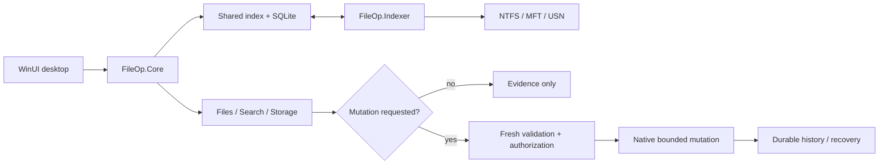

# FileOp

FileOp is a high-performance Windows file and storage manager built around one reusable filesystem index.

The product direction is to combine instant search, power-user file management, storage analysis, duplicate evidence, carefully authorized cleanup, disk health and measurable performance diagnostics without turning into a generic “PC cleaner.”

## At a glance

- **Problem:** fast Windows file tools often separate search, storage analysis and mutation safety into unrelated systems, creating stale state and weak recovery boundaries.
- **Implemented:** shared NTFS/USN-backed indexing, exact paged browsing, SQLite persistence, bounded duplicate evidence, WinUI 3 surfaces, authenticated helper IPC and reviewed Copy/Move/permanent-delete paths.
- **Safety model:** evidence never becomes mutation consent; destructive operations require fresh identity/canonical-path checks, explicit authorization and durable recovery history.
- **Verification:** local Windows gates cover Core/Windows/Indexer builds, native regression/integration tests, the WinUI app, bundled-helper checks and a real helper-process handshake.
- **Boundary:** production signing/package validation still requires a real production certificate dry run before a release is called production-ready.

## Architecture at a glance



### Reviewer path

- Architecture: [`docs/architecture.md`](./docs/architecture.md)
- Exact Files behavior: [`docs/files-browser.md`](./docs/files-browser.md)
- Indexing boundary: [`docs/indexing-service.md`](./docs/indexing-service.md)
- Delete preflight: [`docs/file-delete-preflight.md`](./docs/file-delete-preflight.md)
- Native index synchronization: [`src/FileOp.Windows/Ntfs/NtfsIndexSynchronizer.cs`](./src/FileOp.Windows/Ntfs/NtfsIndexSynchronizer.cs)
- Helper trust policy: [`src/FileOp.Windows/IndexingService/IndexingServiceHelperTrustPolicy.cs`](./src/FileOp.Windows/IndexingService/IndexingServiceHelperTrustPolicy.cs)
- Representative native tests: [`tests/FileOp.Windows.Tests/FileDeleteOperationExecutionValidationTests.cs`](./tests/FileOp.Windows.Tests/FileDeleteOperationExecutionValidationTests.cs)
- Full local verification: [`docs/local-validation.md`](./docs/local-validation.md)

## Status

The implementation has four runtime layers plus a benchmark harness:

- `FileOp.Core` contains filesystem records, query/index contracts, exact paged browse models, in-memory and SQLite-backed analytics, Storage/Optimize evidence models, file-operation/delete contracts, recovery/history models and the versioned indexing-service protocol.
- `FileOp.Windows` contains the Windows/NTFS engine and indexing-service boundary: NTFS discovery, MFT namespace enumeration, USN journal processing, file-ID metadata hydration, hard-link expansion, transactional namespace synchronization, read-only Storage/Optimize providers, Windows file-operation validation/mutation providers and authenticated named-pipe transport.
- `FileOp.Indexer` is the on-demand helper that owns native indexing and per-volume persistent-index writes. It starts unelevated; helper-only UAC is limited to same-account split-token administrators so the desktop never changes integrity level or identity.
- `FileOp.App` is the WinUI 3 desktop shell. Search, Files and Storage share the same native-first metadata source and explicit crawler fallback where that fallback can preserve the required semantics.
- `FileOp.Benchmarks` provides synthetic Search/Storage baselines.

The current indexing-service protocol is **v8**. It exposes version/status discovery, index diagnostics, snapshot rebuild and journal synchronization, Search, exact paged directory browsing, read-only Storage analytics/Optimize analysis and aggregate Storage history. It exposes no cleanup, delete, partition, format or other destructive helper command.

Each NTFS volume/root pair has its own SQLite database. Live reads require a valid durable checkpoint and use shared cross-process leases; rebuild/sync uses an exclusive maintenance lease so multiple FileOp instances cannot expose a partially maintained namespace.

## Search, Files and Storage

Search uses the persistent native NTFS index when available and falls back to the bounded user-profile crawler when native indexing is unavailable. Startup builds or resumes the primary NTFS snapshot, catches the USN cursor up in bounded batches and then continues low-priority synchronization behind foreground work.

Files and native Storage consume the same indexed metadata rows. They do not launch another recursive scan merely to browse names or calculate indexed storage evidence.

### Files

Files is an exact paged browser over direct-child metadata. It requests 256 entries at a time, exposes `Load more` only while a continuation cursor exists and uses keyset ordering rather than offsets.

Browsing itself remains read-only. Files also owns two reviewed mutation surfaces with deliberately different authority:

- the ordinary queue can execute **regular-file Copy** and **same-volume local regular-file Move** after read-only preflight and fresh execution-grade validation;
- the separately reviewed **file-only permanent-delete session** has its own stricter recovery, confirmation, authorization and same-handle mutation boundary.

The Copy/Move queue remains deliberately narrow:

- Copy and Move operate on regular files only; directory Copy/Move mutation is not exposed;
- Copy uses exclusive-create/no-overwrite semantics;
- `Ask later` must be resolved into a fresh immutable **Skip existing** or **Stop on collision** plan before execution;
- same-volume Move uses an identity-preserving handle-relative rename with replacement disabled;
- cross-volume Move remains non-executable until the source-delete half has a separately reviewed durable authorization/recovery transaction;
- per-directory case-sensitive NTFS or unavailable namespace-capability evidence blocks Move before durable mutation history; exact-case mutation is not claimed;
- Copy and Move share one serialized Files execution surface, expose entry-level progress and settle cancellation only at reviewed safe boundaries;
- once an operation reaches durable history, its operation ID is single-use and recovery-sensitive history is never automatic replay authority;
- the Indexer is not used as a file Copy/Move mutation service.

For permanent deletion, destructive authority is not inferred from a selected row, Storage recommendation or cleanup-readiness result. A permanent-delete session requires the current exact Files selection to pass the reviewed sequence:

```text
per-user cross-process destructive-session lock
-> durable recovery-history scan
-> read-only Windows delete preflight
-> canonical/protected-location execution validation
-> explicit permanent-delete confirmation for the exact canonical paths
-> recovery-history recheck
-> session authorization receipt
-> durable action-history begin
-> reviewed file-delete orchestrator and final same-handle mutation boundary
```

The current user-facing delete action is deliberately narrow:

- regular files only; directory deletion is not exposed;
- no generic `FileOperationKind.Delete` is added to the ordinary Copy/Move planning queue;
- no Recycle Bin, undo or restore semantics are claimed;
- unresolved `MutationStarted` / `RecoveryRequired` history blocks new authorization;
- recovery history is never reused as consent or automatic replay authority;
- final-lease cleanup ownership is retained and retried without granting another mutation capability;
- Storage/Optimize and the indexing helper remain non-authorizing.

See `docs/files-browser.md` for the full Copy/Move/browser lifecycle and the `docs/file-delete-*.md` series for the reviewed permanent-delete preflight, authorization, history, stability/final-capability, mutation-barrier and orchestration contracts.

### Folders, Types and Categories

Folder analysis returns direct entries with recursive logical bytes, nullable physical allocation, file/directory counts and hard-link accounting. Types groups the same subtree by normalized extension and deterministic metadata-only category.

Every visible hard-link name contributes logical namespace bytes. Physical allocation is counted once per stable `FileIdentity`; unknown allocation remains unknown instead of being silently replaced with logical size and labelled physical.

### Growth history

Aggregate history stores root totals plus exact category rollups in the same per-volume database. It does **not** retain per-file history or trigger another filesystem scan.

The desktop schedules whole-primary-volume native observations opportunistically only when the native source is current and foreground work is not using the relevant gates. Historical physical comparisons are shown only when the observations have comparable allocation evidence. FileOp does not project a “disk full” date from two points.

### Optimize

The native **Optimize** view is a bounded evidence advisor over the durable index. It surfaces:

- large files, ranked by physical allocation when known and logical size otherwise;
- old large files using an explicit last-write age threshold;
- same-size groups of distinct physical files as a cheap duplicate-candidate prefilter;
- current-user known-location review evidence for Downloads and Temp on the active indexed volume or another already indexed, checkpointed native volume;
- measured Search/Storage/index/performance evidence.

Same-size is **not** content equality. The full indexed group carries only a logical candidate upper bound.

When the user explicitly chooses **Verify content**, FileOp performs bounded desktop-process SHA-256 verification rather than asking the potentially elevated indexer to read arbitrary file content. The default verification budget allows at most **8 sampled files** and **2 GiB** of whole-file content. Partial-file hashes never become duplicate evidence and ordinary Optimize refresh does not hash files automatically.

For SHA-256 matching sampled paths, FileOp then revalidates current handle-level file identity, hard-link count and allocated length. This produces separate evidence levels:

1. full-group same-size candidate logical upper bound;
2. SHA-256-matched sampled logical duplicate bytes;
3. current sampled physical reclaim **upper bound** when physical evidence is sufficient.

The physical value is not permanent and is not deletion authorization. Any later permanent deletion still starts from a fresh Files selection and must independently pass the Files recovery/preflight/canonical-validation/confirmation/authorization boundary.

See `docs/same-size-content-verification.md` and `docs/physical-reclaim-evidence.md` for the content and physical-accounting rules.

#### Optimize thresholds

Optimize threshold controls are display filters over the already-returned bounded native analysis. FileOp supports only **same-or-stricter** thresholds than the helper policy so it never implies the helper examined evidence that was not returned.

Supported policy-relative multipliers can be persisted under the current user's LocalApplicationData tree. Stored preferences are semantic multipliers rather than raw byte/day thresholds and are resolved again against each fresh helper policy. Invalid or unsupported preferences fall back to the baseline.

There is currently no typed helper-policy transport for asking the helper to collect files below its native analysis baseline. The UI fails closed instead of presenting a looser display threshold as complete evidence.

See `docs/storage-threshold-overlay.md` and `docs/storage-threshold-preferences.md`.

#### Known-location review

Downloads is resolved through the Windows known-folder API; Temp uses the current-user environment path. Location, age, size, extension and rule ID remain review provenance only and never establish that a file is safe to delete.

Known-location review can use the active native volume or a redirected Downloads/Temp path on another already indexed, checkpointed native volume. Cross-volume review binds evidence to the exact indexed volume identity/root, requires current checkpoint/catalog provenance before publication, and never rebuilds or switches the primary source implicitly. Candidate rows are admitted only when the indexed path is fully qualified, contained by the reviewed root, and consistent with its indexed name/extension metadata; malformed or out-of-root rows are filtered.

**Check readiness** remains read-only and can revalidate a reviewed cross-volume candidate against its owning indexed source. **Review in Files** remains primary-volume-only: cross-volume candidates are not handed to Files through a direct-filesystem fallback. Permanent deletion still starts independently from Files and must pass its fresh delete boundary.

## Performance and device evidence

Optimize/Performance diagnostics favor measurement over “tuning” claims. Current capabilities include bounded Search/Storage latency probes, helper SQLite/index diagnostics, resource-footprint evidence, disk-I/O attribution and timing/loss evidence, system CPU/memory context, physical-device context, failure-prediction/health evidence where supported, and fragmentation analysis.

These surfaces are evidence only. FileOp does not perform registry cleaning, RAM boosting, arbitrary service disabling, automatic database `VACUUM`, forced WAL checkpointing or opaque health scoring.

## Trust and privilege boundary

`FileOp.App` always remains non-elevated. Native indexing starts with the current token and reports structured elevation requirements when necessary. Same-account helper-only UAC is allowed only for split-token administrators; different-admin credential elevation remains unsupported until a separately reviewed service/ACL design exists.

The per-session pipe is restricted to the current Windows user and exact desktop PID. Requests are versioned, framed and capped. Interrupted exchanges fault the session rather than risking request/response desynchronization.

Elevated helper launch is fail-closed around the installed helper identity. FileOp requires the exact adjacent non-reparse `FileOp.Indexer.exe`, verifies the primary embedded Authenticode signature through Windows policy, rejects secondary embedded signatures so signer selection is unambiguous, requires that signer thumbprint to match build-owned assembly metadata, and rejects a helper/app installation path the unelevated token can mutate through the tested write/delete/ACL-ownership rights. Release builds do not accept a runtime environment variable as a signer trust root.

The release tooling builds/signs the x64 app/helper payload, emits a per-file hash manifest and a whole-ZIP SHA-256 for independently authenticated release metadata, and installs only when the caller supplies both the expected package hash and signer thumbprint. Install/update/uninstall require the app and indexer processes to be quiescent; update uses staged directory replacement with rollback and uninstall preserves per-user FileOp data unless purge is explicitly requested.

These mechanisms still require a real production signing-certificate package/install/elevated-helper dry run before a release is declared production-ready. See `docs/release-packaging.md` and `docs/windows-release-validation.md`.

## Query examples

```text
invoice
ext:pdf invoice
size:>100mb
ext:zip size:>1gb backup
```

## Build

Requirements:

- .NET 10 SDK
- Windows 10 1809 or later for the native engine/indexer and desktop app
- Python 3 for the zero-Actions verifiers

Representative builds:

```powershell
dotnet build src/FileOp.Core/FileOp.Core.csproj -c Release
dotnet build src/FileOp.Windows/FileOp.Windows.csproj -c Release
dotnet build src/FileOp.Indexer/FileOp.Indexer.csproj -c Release -p:Platform=x64
dotnet test tests/FileOp.Windows.Tests/FileOp.Windows.Tests.csproj -c Release
dotnet build src/FileOp.App/FileOp.App.csproj -c Release -p:Platform=x64
```

The desktop build copies the reviewed indexer host artifacts beside the app. The complete local gate checks those bundled artifacts and performs a real helper-process handshake.

## Local verification without GitHub Actions

`tools/test-local.ps1` is the **authoritative verification inventory**. Individual verifier names evolve as reviewed boundaries are added, so this README intentionally does not duplicate the complete list.

Run all standard-library model/source verifiers without requiring the .NET SDK:

```powershell
powershell.exe -NoProfile -ExecutionPolicy Bypass -File tools/test-local.ps1 -OfflineOnly
```

Run the complete Windows no-Actions gate:

```powershell
powershell.exe -NoProfile -ExecutionPolicy Bypass -File tools/test-local.ps1
```

The complete gate runs the offline verifiers, Core/Windows/Indexer/benchmark Release builds, the Windows regression/integration test suite, WinUI x64 Release build, bundled-helper artifact checks and a real bundled-helper process handshake. `docs/local-validation.md` documents the gate and narrower development switches. `docs/windows-release-validation.md` records the focused mutation/signing scenarios required for the current release-hardening stack.

Benchmarks remain manual:

```powershell
dotnet run -c Release --project benchmarks/FileOp.Benchmarks -- --filter *SearchBenchmarks*
dotnet run -c Release --project benchmarks/FileOp.Benchmarks -- --filter *StorageAnalyticsBenchmarks*
```

## Repository layout

```text
src/
  FileOp.Core/       Search/index/browse/storage/operation domain and service contracts
  FileOp.Windows/    Windows-native NTFS/USN engine, indexing IPC and file-operation providers
  FileOp.Indexer/    On-demand native indexing helper process
  FileOp.App/        WinUI 3 desktop app with Search + Files + Storage/Performance surfaces

tests/
  FileOp.Windows.Tests/  Native, persistence, operation and integration regressions

benchmarks/
  FileOp.Benchmarks/     Synthetic Search/Storage baselines

tools/
  test-local.ps1        Authoritative offline/full local verification gate

docs/
  architecture.md                     Architectural boundaries and lifecycle
  files-browser.md                    Indexed Files browsing + Copy/Move execution boundary
  storage-optimization.md             Optimize policy/safety semantics
  same-size-content-verification.md   Explicit bounded SHA-256 verification
  physical-reclaim-evidence.md        Current physical reclaim upper-bound evidence
  storage-threshold-preferences.md    Persisted same-or-stricter threshold preferences
  release-packaging.md                Signer/package/install/update trust boundary
  local-validation.md                 No-Actions validation workflow
  windows-release-validation.md       Focused native release validation checklist
  file-delete-*.md                    Reviewed file-delete safety/mutation contracts
```

## Principles

1. Speed is a feature: no feature should silently trigger a full rescan when the shared index can answer it.
2. Expensive metadata is lazy: hashes and similar content work run only on explicit bounded paths or reviewed idle work.
3. Evidence is not authority: recommendations, hashes, reclaim estimates and readiness checks do not become mutation consent.
4. Destructive actions require explicit reviewed boundaries and fresh action-time validation.
5. The normal UI is never permanently elevated; privileged administration remains isolated.
6. Avoid fake optimisation features such as registry cleaning, RAM boosting and opaque health scores.
